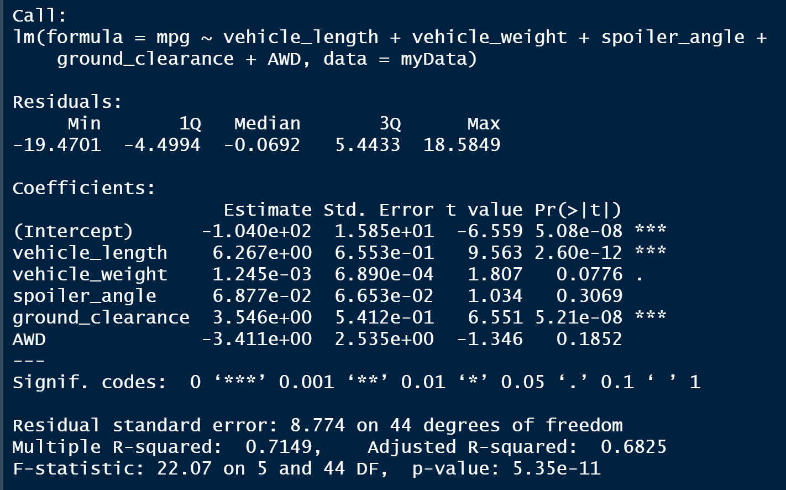
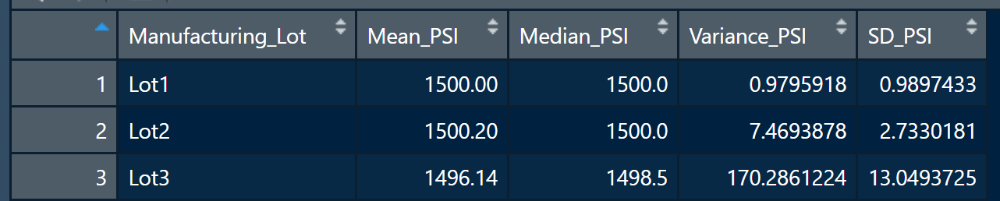
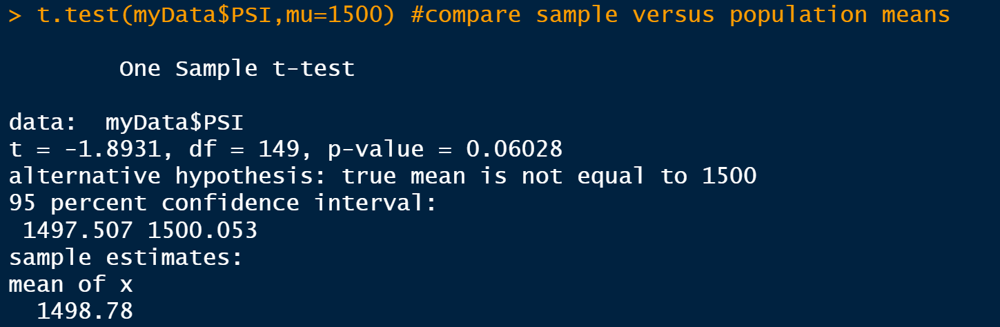
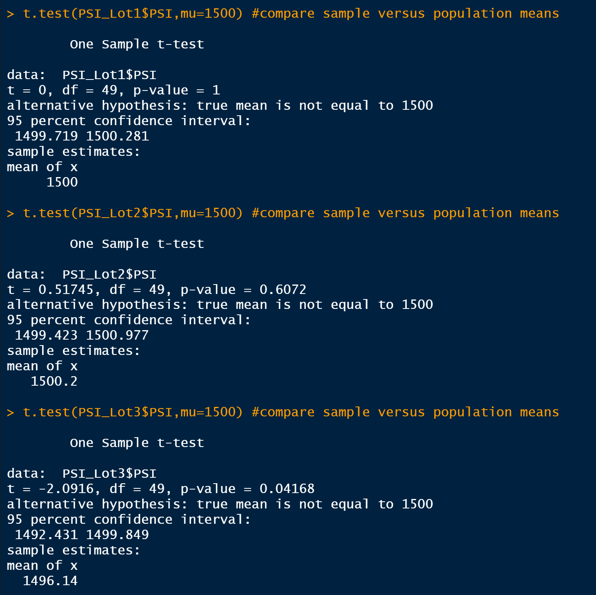

# MechaCar_Statistical_Analysis

## Objective

- AutosRUs’ newest prototype, the MechaCar, is suffering from production troubles that are blocking the manufacturing team’s progress.
- AutosRUs’ upper management had asked the data analytics team to review the production data for insights that may help the manufacturing team, performing the following analysis:
  - Perform multiple linear regression analysis to identify which variables in the dataset predict the mpg of MechaCar prototypes
  - Collect summary statistics on the pounds per square inch (PSI) of the suspension coils from the manufacturing lots
  - Run t-tests to determine if the manufacturing lots are statistically different from the mean population
  - Design a statistical study to compare vehicle performance of the MechaCar vehicles against vehicles from other manufacturers. For each statistical analysis, you’ll write a summary interpretation of the findings.

## Results

### 1 Linear Regression to Predict MPG

- Which variables/coefficients provided a non-random amount of variance to the mpg values in the dataset?
  - As observed in Pr(<|t|) vehicle_length, vehicle_weight and the Intercept are statistically unlikely to provide random amounts of variance to the linear model.

- Is the slope of the linear model considered to be zero? Why or why not?
  - No, as the p-value of the model (5.35e-11) is significantly lower to a confidence value of 0.5%, the Null hypothessis (H0) can be rejected.

- Does this linear model predict mpg of MechaCar prototypes effectively? Why or why not?
  - The model seems to be fairly effective, as the R-squared is 0.7149.

## 2 Summary Statistics on Suspension Coils

### PSI Total Summary

### PSI Lot Summary

- The design specifications for the MechaCar suspension coils dictate that the variance of the suspension coils must not exceed 100 pounds per square inch. Does the current manufacturing data meet this design specification for all manufacturing lots in total and each lot individually? Why or why not?
  - Despite that the Variance reported in the Total Summary (62) is not exceeding the quality parameter, the Lot3 is doesn't meet the requirement (170), it should be recalled for inspection.

## 3 T-Tests on Suspension Coils

### PSI t-test all lots

- Null Hypothesis (Lot mean is equal to population mean = 1500) is rejected by a relatively small amount but is superior to 5% confidence

### PSI t-test per lot

- The only lot where the Null Hypothesis is not rejected is Lot 3

## Sumary

### 1 Linear Regression to Predict MPG

### 2 Summary Statistics on Suspension Coils

### 3 T-Test on Suspension Coils

### 4 Design a Study Comparing the MechaCar to the Competition

